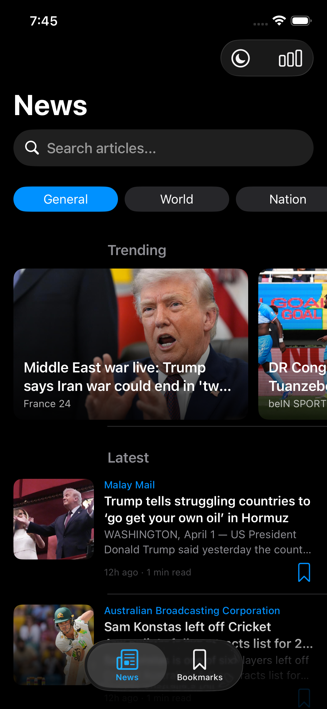
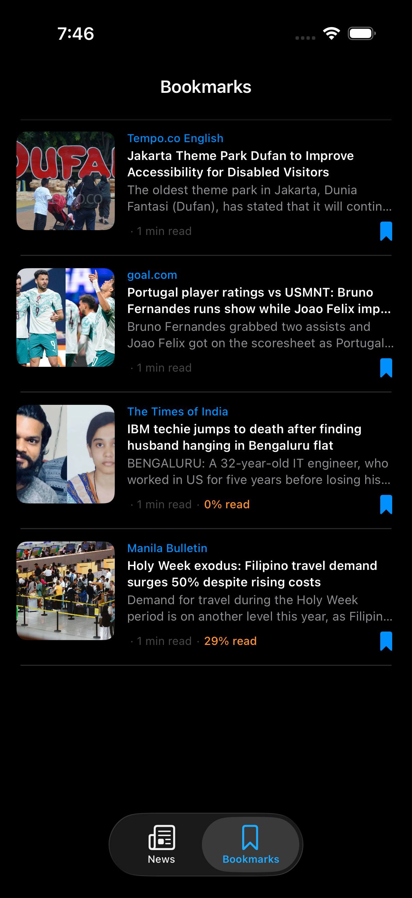
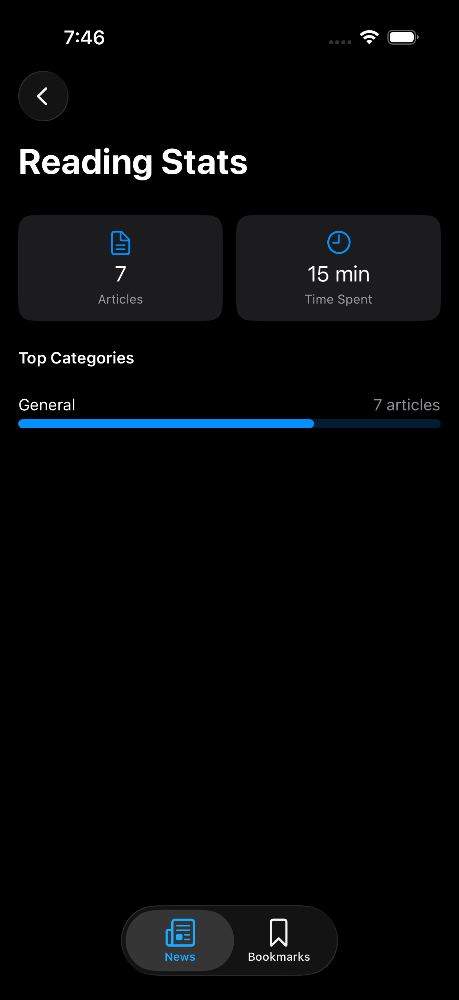
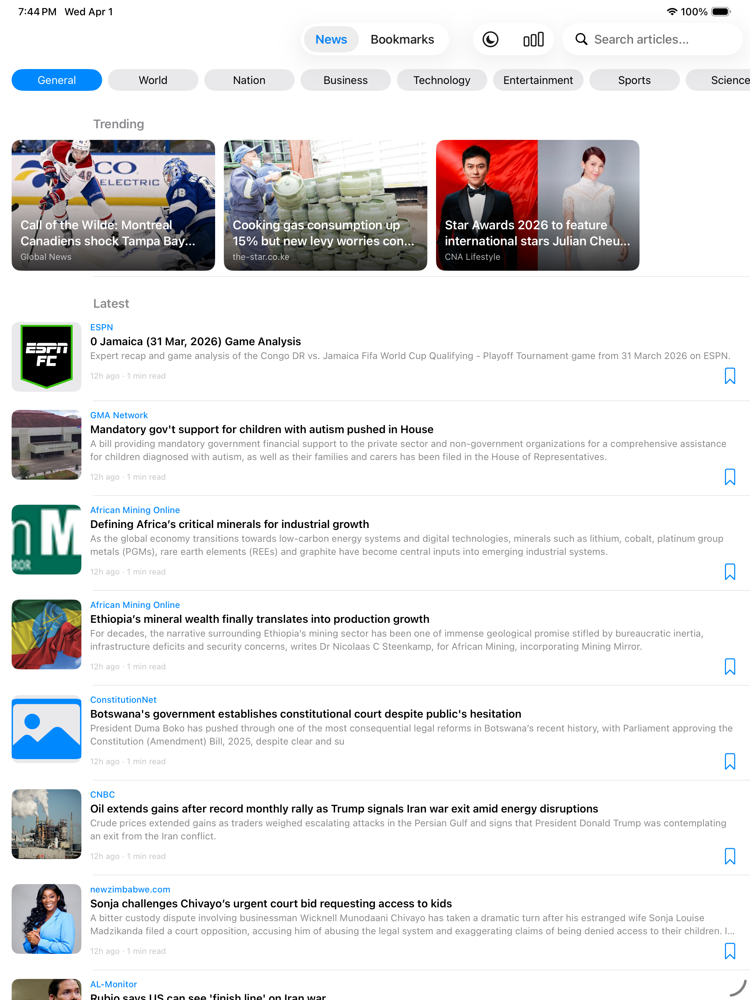
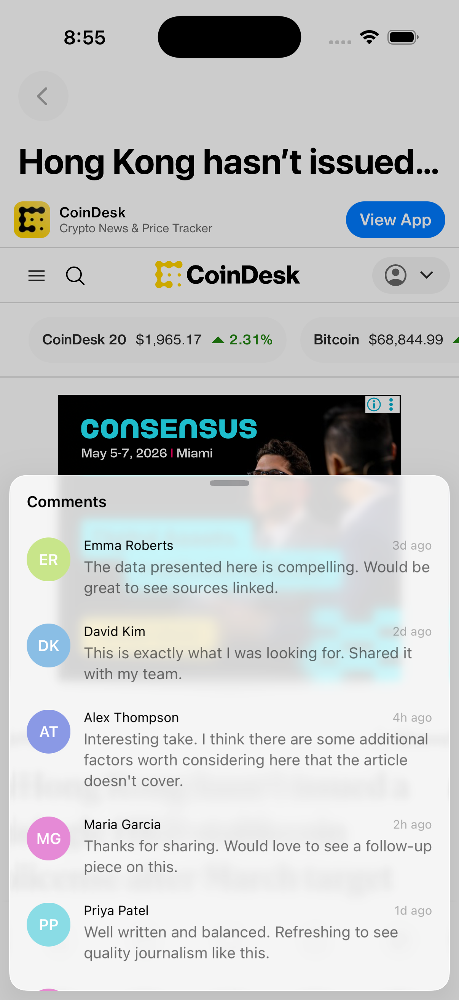
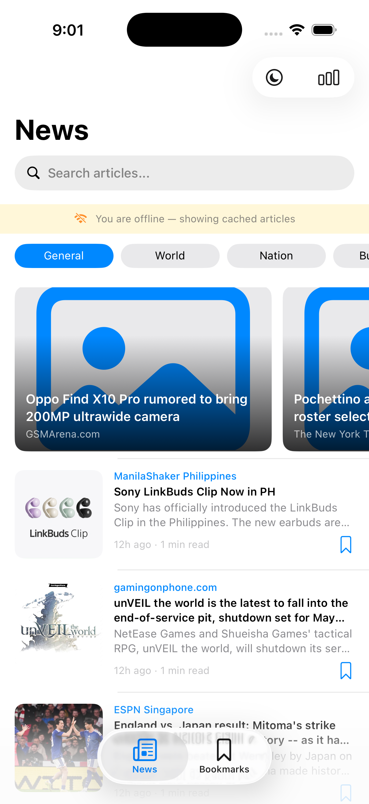

# News Reader

A fully-featured iOS News Reader app built with **UIKit**, **Combine**, **Clean Architecture**, and **MVI** pattern. Fetches live news from the [GNews API](https://gnews.io), supports offline reading, bookmarks, categories, deep linking, and more.

## Screenshots

| Feed (Dark Mode) | Bookmarks (Read %) | Reading Stats |
|:---:|:---:|:---:|
|  |  |  |

| iPad | Article Detail | Offline Mode |
|:---:|:---:|:---:|
|  |  |  |

## Features

### Core
| Feature | Description |
|---------|-------------|
| News Feed | Paginated feed with infinite scroll from GNews API |
| Article Detail | Full article in WKWebView with reader mode toggle |
| Search | Server-side search with 500ms debounce |
| Bookmarks | Save/unsave articles locally with CoreData |
| Categories | 9 category filters (General, Sports, Tech, Business, etc.) |
| Trending | Top 3 articles highlighted in horizontal card scroll |

### Reading Experience
| Feature | Description |
|---------|-------------|
| Reader Mode | Clean serif layout extracted from page content |
| Read Progress | Scroll position saved per article, never goes backwards |
| Read % on Bookmarks | Shows "45% read" or "Completed" on bookmarked articles |
| Reading Time | Estimated reading time on each card (word count / 200 wpm) |
| Reading Stats | Articles read this week, time spent, top categories |

### Offline & Persistence
| Feature | Description |
|---------|-------------|
| Offline Mode | Auto-navigates to Bookmarks when offline, cached HTML for previously viewed articles |
| CoreData | 4 entities: BookmarkedArticle, CachedArticle, ReadProgress, ReadingSession |

### UX Polish
| Feature | Description |
|---------|-------------|
| Dark Mode Toggle | Switch between light/dark via nav bar button |
| Pull to Refresh | Spinner stays until network call completes |
| Loading Footer | Spinner at bottom during pagination |
| Empty States | Contextual messages for no results, errors, no bookmarks |
| Deep Linking | `newsreader://article?url=<encoded>` opens articles |
| Comments | Mock comment section via bottom sheet |
| Local Notifications | Trending article notifications |
| Share | Share articles via system share sheet |
| Open in Safari | Direct Safari launch from detail |

## Architecture

### Clean Architecture + MVI

```
┌─────────────────────────────────────────────────┐
│                  Presentation                    │
│  ┌──────────┐  ┌──────────┐  ┌───────────────┐  │
│  │   View   │──│ ViewModel│──│   Contract    │  │
│  │  (UIKit) │  │  (MVI)   │  │ State/Action/ │  │
│  │          │  │          │  │   Effect      │  │
│  └──────────┘  └──────────┘  └───────────────┘  │
│       │ send()      │ statePublisher             │
├─────────────────────────────────────────────────┤
│                    Domain                        │
│  ┌──────────────────┐  ┌──────────────────────┐  │
│  │  Repository      │  │   Domain Models      │  │
│  │  (protocols)     │  │   (Article, etc.)    │  │
│  └──────────────────┘  └──────────────────────┘  │
├─────────────────────────────────────────────────┤
│                     Data                         │
│  ┌────────┐ ┌──────────┐ ┌────────┐ ┌────────┐  │
│  │  DTOs  │ │ Endpoints│ │  Repos │ │Services│  │
│  │        │ │  (enum)  │ │ (impl) │ │        │  │
│  └────────┘ └──────────┘ └────────┘ └────────┘  │
├─────────────────────────────────────────────────┤
│              Core SPM Module                     │
│  ┌──────────────────┐  ┌──────────────────────┐  │
│  │    Networking     │  │  LocalPersistence    │  │
│  │ HTTPClient,      │  │ ManagedObjectStore,  │  │
│  │ Endpoint,        │  │ PersistentContainer  │  │
│  │ NetworkMonitor   │  │   Provider           │  │
│  └──────────────────┘  └──────────────────────┘  │
└─────────────────────────────────────────────────┘
```

### MVI Flow

```
View ──send(Action)──> ViewModel ──updates──> StatePublisher ──renders──> View
                           │
                           └──sends──> EffectPublisher ──one-time──> View
```

- **State**: Single immutable struct per screen (via `StatePublisher` — read-only for views)
- **Action**: Enum of all user intents (tap, scroll, search, etc.)
- **Effect**: One-time events (navigation, error toast, etc.)

### Dependency Injection

```swift
// Register singleton (stateful, shared)
container.register(bookmarkRepo as BookmarkRepository)

// Register factory (stateless, created per-use)
container.factory { ReadProgressRepositoryImpl(context: bgContext) as ReadProgressRepository }

// Resolve via property wrapper
@Injected private var notificationService: TrendingNotificationService
```

## Project Structure

```
News/
├── App/                                    # App lifecycle & DI
│   ├── AppDelegate.swift
│   ├── SceneDelegate.swift
│   ├── DependencyContainer.swift           # DI with @Injected property wrapper
│   ├── TabBarController.swift
│   ├── ViewModel.swift                     # MVI protocol + StatePublisher + NoEffect
│   └── ContentState.swift                  # Generic ContentState<T> + PaginationState
│
├── Domain/Models/
│   └── Article.swift                       # Core domain model (no Codable)
│
├── Data/DataSources/
│   ├── CoreDataStack.swift                 # Managed object subclasses + toArticle() mappers
│   └── News.xcdatamodeld                   # CoreData GUI model (4 entities)
│
├── Features/
│   ├── Feed/
│   │   ├── Data/
│   │   │   ├── DTOs/                       # ArticleDTO, NewsResponseDTO (Codable)
│   │   │   ├── Endpoints/                  # NewsEndpoint enum (.topHeadlines, .search)
│   │   │   ├── Repositories/               # NewsRepositoryImpl, ArticleCacheRepositoryImpl, NewsPaginator
│   │   │   └── Services/                   # TrendingNotificationService
│   │   ├── Domain/                         # NewsRepository, ArticleCacheRepository protocols
│   │   └── Presentation/
│   │       ├── FeedContract.swift           # FeedState, FeedAction, FeedEffect
│   │       ├── ArticleViewState.swift       # Presentation-ready model + Article mapper
│   │       ├── ViewModel/                   # NewsFeedViewModel
│   │       ├── View/                        # NewsFeedViewController
│   │       └── Component/                   # ArticleCell, TrendingCell, CategoryFilterView, LoadingFooterCell
│   │
│   ├── ArticleDetail/
│   │   ├── Data/Repositories/              # ReadProgressRepositoryImpl
│   │   ├── Domain/                         # ReadProgressRepository protocol
│   │   └── Presentation/
│   │       ├── ArticleDetailContract.swift
│   │       ├── ViewModel/                  # ArticleDetailViewModel
│   │       └── View/                       # ArticleDetailViewController (WebView + reader mode)
│   │
│   ├── Bookmarks/
│   │   ├── Data/Repositories/              # BookmarkRepositoryImpl (FRC + publisher)
│   │   ├── Domain/                         # BookmarkRepository protocol
│   │   └── Presentation/
│   │       ├── BookmarksContract.swift
│   │       ├── ViewModel/                  # BookmarksViewModel
│   │       └── View/                       # BookmarksViewController
│   │
│   ├── Comments/                           # Mock comment section (bottom sheet)
│   ├── ReadingStats/                       # Reading stats screen (articles, time, categories)
│   └── Common/Presentation/Component/     # EmptyStateView, LoadingView, OfflineBannerView
│
├── Utilities/
│   ├── ImageLoader.swift                   # Combine-based with cache + dedup + .share()
│   ├── DeepLinkRouter.swift                # newsreader:// URL scheme handler
│   └── DateFormatter+Extensions.swift      # Date.timeAgo
│
└── Modules/Core/                           # SPM package (2 targets)
    ├── Sources/Networking/                 # HTTPClient, Endpoint, NetworkError, NetworkMonitor
    └── Sources/LocalPersistence/           # ManagedObjectStore, PersistentContainerProvider
```

## Tech Stack

| Layer | Technology |
|-------|-----------|
| UI | UIKit (programmatic, no storyboards) |
| Reactive | Combine |
| Architecture | Clean Architecture + MVI |
| Networking | URLSession via HTTPClient (retry + exponential backoff) |
| Persistence | CoreData (programmatic + GUI model) |
| Image Loading | Combine-based with NSCache + request deduplication |
| DI | Custom container with `@Injected` property wrapper |
| API | GNews API (top-headlines + search, server-side pagination) |
| Modules | Swift Package Manager (Networking + LocalPersistence) |
| Testing | Swift Testing framework + XCTest |

## Testing

```
NewsTests/
├── NewsTests.swift              # 20+ tests: models, DTOs, ViewModels, mappers, deep links, ContentState
└── BookmarkServiceTests.swift   # 4 tests: CoreData integration (add, remove, publisher, multiple)

Modules/Core/Tests/
├── NetworkingTests/
│   ├── HTTPClientTests.swift            # NetworkError, NetworkMonitor, KeyValueStore, TokenStore
│   └── HTTPClientIntegrationTests.swift # MockURLProtocol: 200, 500, 400, retry, non-retryable
└── LocalPersistenceTests/
    └── LocalPersistenceTests.swift      # ManagedObjectStore CRUD: create, fetch, count, delete, upsert, sort
```

## Requirements

- iOS 16+
- Xcode 16+
- Swift 5.9+

## Setup

### 1. Clone
```bash
git clone https://github.com/noob-programmer1/News.git
cd News
```

### 2. Build & Run
```bash
open News.xcodeproj
```
- Select a simulator (iPhone 16e or newer recommended)
- `Cmd + R` to build and run
- Add your GNews API key in `Info.plist` under `GNEWS_API_KEY`
- Get a free key at [gnews.io](https://gnews.io) (100 requests/day on free tier)

### 3. Run Tests
```bash
# Via Xcode
Cmd + U

# Via command line
xcodebuild test -project News.xcodeproj -scheme News -destination 'platform=iOS Simulator,name=iPhone 16e'
```

## Deep Linking

Test deep links via terminal while the simulator is running:
```bash
xcrun simctl openurl booted "newsreader://article?url=https://example.com/news"
```

## Notes

- **Minimum deployment**: iOS 16+
- **Xcode**: 16+
- **Swift**: 5.9+ (Swift 6 for Core module Networking target)
- **No third-party dependencies** — all Apple frameworks + custom SPM modules
- **Offline mode**: When offline, the app navigates to Bookmarks. Previously opened articles have cached HTML for offline reading.
- **Dark mode**: Tap the moon icon in the feed nav bar to toggle
